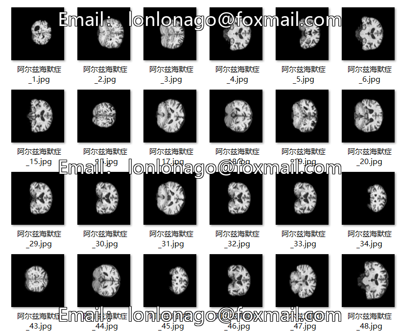
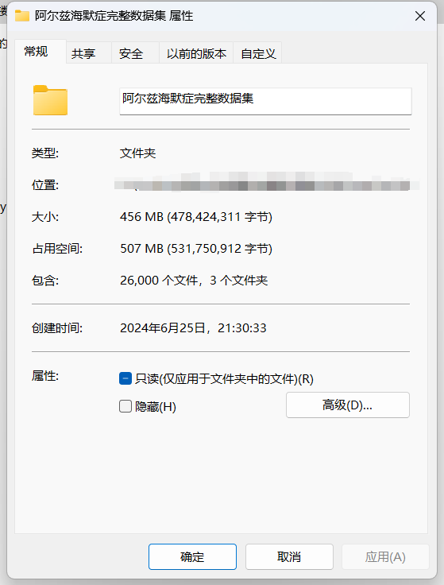
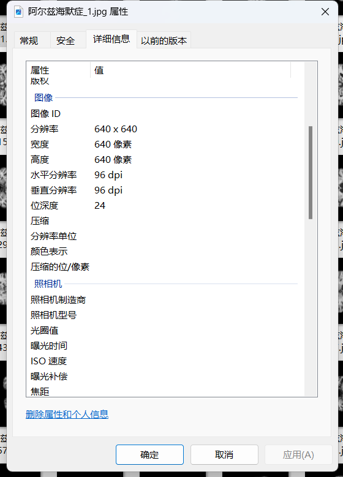

# Alzheimer's Disease Image Classification Dataset

Dataset Information:
- Number of images in the "Health" folder: 8000
- Number of images in the "Early Mild Cognitive Impairment" folder: 10000
- Number of images in the "Alzheimer's" folder: 8000
- Total number of images across all subfolders: 26000
+

For inquiries, simply add your question and intent directly. I am not on friend verification and do not need my permission to respond to you directly. You can message me without any formalities, as I can see your messages.

When searching for me, please send a complete question at once. I will reply to you, sometimes busy, so please clarify your intentions when I am free.

I will also respond to you when I am available, without any formality, to ensure efficiency.

Your phone number is the same as above. If I forget to reply or you are impatient, you can also send a text or call.

## Image

Here is a pay link on Stripe ( https://buy.stripe.com/3cs8yP7sY87d0vu9AB ). Please contact me lonlonago@foxmail.com after funding $89, and I will send you a complete data files , thank you!

